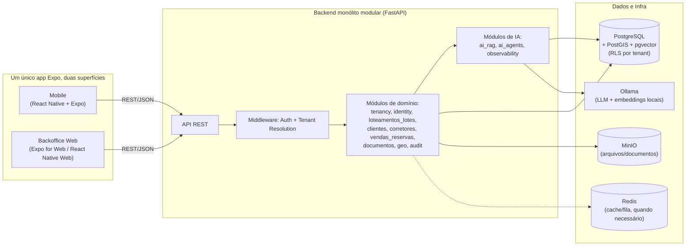
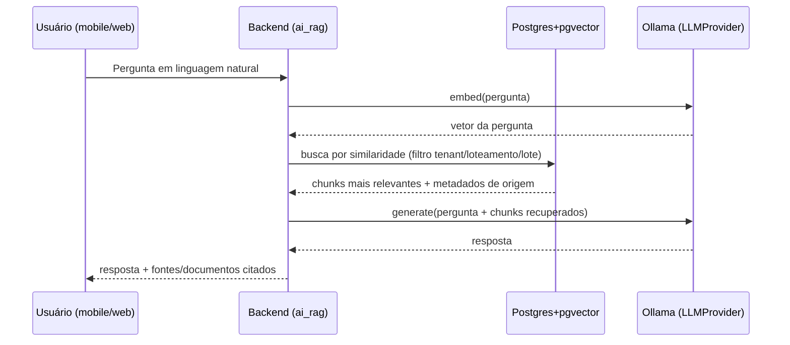

# 02 — Arquitetura (Etapa 2)

## Visão geral

Monólito modular. Sem microservices. Um único backend FastAPI (API REST pura) dividido em módulos por domínio, um único app Expo consumido em duas superfícies (mobile e web/backoffice), e um único PostgreSQL com as extensões PostGIS e pgvector.

## Componentes e responsabilidades

### App Expo único (React Native + TypeScript), duas superfícies: mobile e web

Uma única base de código (`mobile/`), consumida em dois alvos de build do Expo (nativo e web) — não dois frontends separados. Decisão D2 em [03-decisoes-tecnicas.md](03-decisoes-tecnicas.md): evita duplicar autenticação, chamadas de API, tipos e componentes de UI entre um app mobile e um backoffice à parte.

- **Mobile (produto principal):** usado por corretores e gestores em campo. Cache local somente-leitura em SQLite (`expo-sqlite`) dos dados do tenant ativo (loteamentos, lotes recentes, clientes recentes). Detecção de conectividade: toda ação de escrita verifica conexão antes de habilitar; sem conexão, mostra aviso e desabilita a ação (sem fila — ver [01-analise-requisitos.md](01-analise-requisitos.md)). Tela de consulta ao agente de IA (chat) quando houver conexão.
- **Web (backoffice mínimo):** mesmas telas de domínio herdadas do mobile onde fizer sentido, mais rotas específicas para o que é inviável em tela pequena: import de CSV, revisão/edição de polígono, gestão de documentos. Não é um segundo produto — escopo restrito às tarefas administrativas do briefing.
- **Onde as duas superfícies divergem**, usar arquivos por plataforma (`Componente.native.tsx` / `Componente.web.tsx`) atrás de uma interface única, em vez de `if (Platform.OS === 'web')` espalhado pelo código:
  - **Armazenamento de sessão:** `expo-secure-store` no nativo; `localStorage`/cookie no web — abstraído atrás de um módulo `storage` único desde a Fase 3.
  - **Mapa:** `react-native-maps` (provider Google Maps) no nativo; no web, um wrapper que também usa a API JavaScript do Google Maps mantendo a mesma interface de `MapView`/`Polygon` (ex.: `@teovilla/react-native-web-maps` ou equivalente) — ver decisão D8. Geometrias sempre vêm do backend (PostGIS); o mapa é só visualização (ou edição, no caso do editor de polígono na web).
  - **Editor/desenho de polígono:** só existe na implementação web do componente de mapa (biblioteca de desenho sobre o Google Maps), já que essa tarefa é assumidamente de backoffice.
- Consome a mesma API REST do backend (JSON, autenticação via JWT) em ambas as superfícies — o backend não tem nenhuma noção de "backoffice", só serve a mesma API para um cliente que roda em duas plataformas.

### Backend — monólito modular (FastAPI)
Módulos por domínio, cada um com separação leve (não uma "clean architecture" pesada) entre:
- **domain**: entidades, regras de negócio, máquina de estados.
- **application**: casos de uso/serviços que orquestram domain + infra.
- **infrastructure**: acesso a Postgres/MinIO/Redis/Ollama.
- **interface**: rotas FastAPI (REST) — sem templates server-rendered; o backoffice web é o mesmo app Expo, não uma interface própria do backend (ver seção "App Expo único" acima).

Módulos:
- `tenancy` — cadastro de tenants, resolução de tenant por request, configuração de sessão RLS.
- `identity` — autenticação, usuários, papéis/permissões (RBAC), convite/ativação, `user_tenant_membership`.
- `loteamentos_lotes` — loteamentos, lotes, estados/transições, características.
- `clientes` — cadastro de clientes.
- `corretores` — cadastro de corretores, responsável por lote/venda.
- `vendas_reservas` — reservas e vendas, regras de transição associadas ao lote.
- `documentos` — upload, versionamento simples, metadados de documentos (memorial, contratos, tabelas de preço).
- `geo` — camada de acesso PostGIS (consultas espaciais, validação/correção manual de geometria).
- `audit` — trilha de auditoria de ações sensíveis (imutável).
- `ai_rag` — chunking, embeddings, indexação e busca semântica sobre `documentos`.
- `ai_agents` — orquestração LangGraph, tools sobre os serviços de aplicação dos outros módulos.
- `observability` — logging estruturado, métricas de IA (latência, tokens), avaliação (golden-set).

### PostgreSQL + PostGIS + pgvector
- Banco único. Toda tabela de domínio tem `tenant_id` e política RLS correspondente.
- PostGIS é a **fonte de verdade geográfica** — não o Google Maps, que é só visualização. SRID único (WGS84/4326) em todo o sistema.
- pgvector guarda embeddings dos chunks de documentos, com metadados de escopo (`tenant_id` obrigatório, `loteamento_id`/`lote_id` opcionais) para filtragem em qualquer granularidade.

### Redis
- Disponível desde a Fase 0 (docker-compose), mas só passa a ser efetivamente usado a partir da Fase 7, como broker de fila (RQ) para o processamento assíncrono de ingestão de documentos (chunking + geração de embeddings) — decisão D3 em [03-decisoes-tecnicas.md](03-decisoes-tecnicas.md). A Fase 8 (extração de imagem, mais pesada) reaproveita a mesma fila em vez de introduzir uma nova peça de infraestrutura.

### MinIO
- Armazenamento de documentos/imagens compatível com S3, rodando localmente via Docker.
- Acessado através de uma interface de storage abstrata no módulo `documentos`, para permitir trocar para AWS S3 depois sem alterar lógica de negócio.

### Ollama + abstração `LLMProvider`
- Runtime local de LLM e embeddings.
- Toda chamada de IA no backend passa por uma interface `LLMProvider` (ex.: `generate()`, `embed()`), com `OllamaProvider` como implementação inicial. Outras implementações (OpenAI, Gemini, Bedrock) podem ser adicionadas depois sem tocar `ai_rag`/`ai_agents`.

## Fluxo de dados — visão geral

Mobile/Web → API REST (FastAPI) → middleware de auth + resolução de tenant → serviço de aplicação do módulo correspondente → Postgres (sessão com `tenant_id` setado via `SET LOCAL`) / MinIO / Redis (quando aplicável) / Ollama (via `LLMProvider`).

## Fluxo RAG

Upload de documento (fluxo de indexação): upload → armazenado no MinIO → chunking → `embed()` de cada chunk via `LLMProvider` → gravado no pgvector com metadados de escopo. Reindexação: mesmo fluxo disparado manualmente ou quando o documento é substituído.

## Fluxo do agente (LangGraph)

Pergunta em linguagem natural → grafo de agente (LangGraph) → o grafo decide qual(is) tool(s) chamar → tools chamam **serviços de aplicação já existentes** dos módulos de domínio (nunca SQL cru vindo do agente) → resultado estruturado é formatado em linguagem natural pelo LLM → se a ação envolvida for sensível/destrutiva (ex.: cancelar reserva, alterar preço), o grafo pausa em um nó de confirmação humana antes de executar.

Exemplos de tools disponíveis ao agente: buscar lotes (com filtros determinísticos, incluindo espaciais via `geo`), consultar lote, consultar disponibilidade, buscar documentos (via `ai_rag`), consultar clientes, consultar vendas, consultar corretores, consultar condições comerciais.

## Multi-tenancy

- Middleware resolve o `tenant_id` a partir do token JWT em cada request.
- Dentro da transação de banco, executa `SET LOCAL app.tenant_id = '<id>'`.
- Políticas RLS em cada tabela de domínio restringem todas as operações (`SELECT`/`INSERT`/`UPDATE`/`DELETE`) ao `tenant_id` da sessão.
- Consultas vetoriais (pgvector) aplicam o filtro de tenant explicitamente na cláusula `WHERE`, como camada extra de proteção — não dependem só da RLS no caminho de IA.
- `user` é uma entidade independente de tenant; a associação usuário↔tenant (com papel) vive em `user_tenant_membership`, preparando o terreno para um usuário pertencer a mais de um tenant no futuro, mesmo que hoje só exista uma membership por usuário na prática.

## Offline

- Mobile mantém cache local (SQLite) somente-leitura dos dados do tenant ativo.
- Toda ação de escrita verifica conectividade antes: sem conexão, a ação fica desabilitada com uma mensagem explicando que é necessária internet para editar.
- Sem fila de operações offline, sem resolução de conflitos — simplificação deliberada (ver [01-analise-requisitos.md](01-analise-requisitos.md)).
